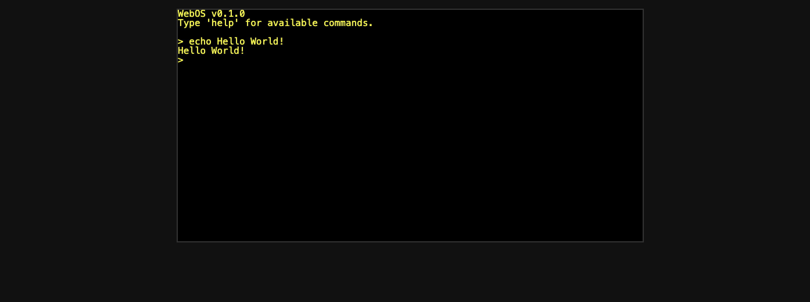

# webos

[link](https://finicky-knot.surge.sh)

what if an os kernel could run in the web and on a standard device?
that's webos. all programs are in rust and async and filesystem should work on both

## How to run

### Web
Make sure you have rust and the wasm32-unknown-unknown target installed
then run ./build-web.sh and the site will be in _site/

### x86 image
just run cargo build and your image should be at target/x86_64-webos/debug/bootimage-webos.bin
to just run in qemu just use cargo run
